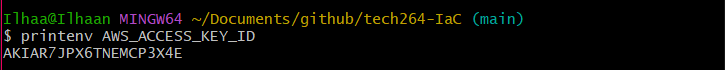
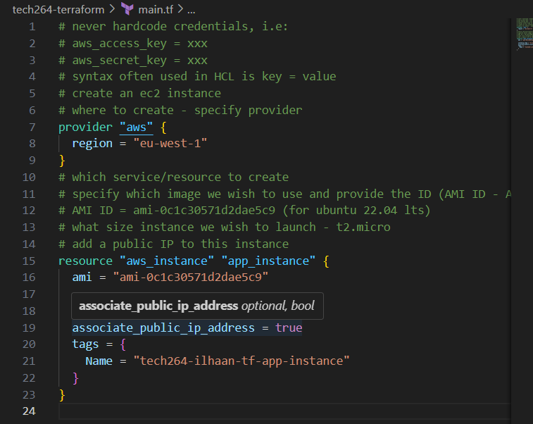
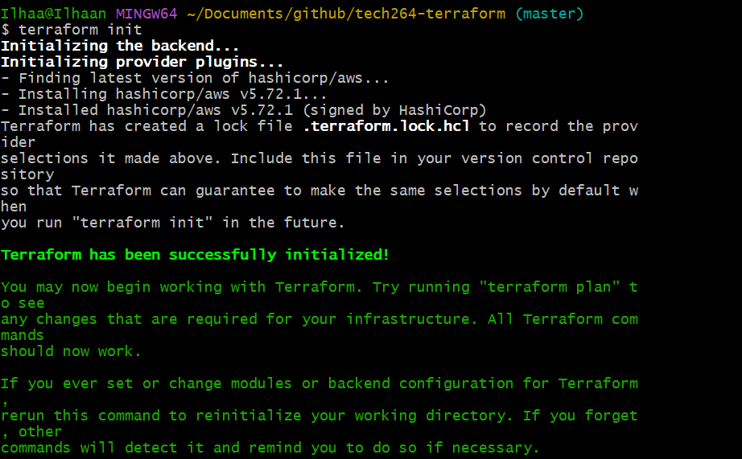

# ***TERRAFORM*** 🏗️
- [***TERRAFORM*** 🏗️](#terraform-️)
  - [***What is Terraform? What is it used for?*** 🏭](#what-is-terraform-what-is-it-used-for-)
  - [***Why use Terraform? The benefits?*** 👍🏾](#why-use-terraform-the-benefits-)
  - [***Alternatives to Terraform*** 🧟‍♀️](#alternatives-to-terraform-️)
  - [***Who is using Terraform in the industry?*** 👨🏾‍👩🏾‍👧🏾‍👦🏾](#who-is-using-terraform-in-the-industry-)
  - [***In IaC, what is orchestration? How does Terraform act as an "orchestrator"?*** 🎺](#in-iac-what-is-orchestration-how-does-terraform-act-as-an-orchestrator-)
  - [***Credentials*** 🔐](#credentials-)
    - [***How Terraform looks up AWS credentials (priority order)*** 🎁](#how-terraform-looks-up-aws-credentials-priority-order-)
    - [***Best practices for supplying AWS credentials to Terraform*** 🗝️](#best-practices-for-supplying-aws-credentials-to-terraform-️)
    - [***How AWS credentials should never be passed to Terraform*** ⛔](#how-aws-credentials-should-never-be-passed-to-terraform-)
  - [***Why use Terraform for different environments (e.g., production, testing, etc.)*** 🖥️](#why-use-terraform-for-different-environments-eg-production-testing-etc-️)
  - [***Downloading Terraform*** 💾](#downloading-terraform-)
    - [***Adding my credentials to system variables in my computer*** 🔐](#adding-my-credentials-to-system-variables-in-my-computer-)
  - [***Creating a terraform repo with a .gitignore*** 🤷🏾‍♀️](#creating-a-terraform-repo-with-a-gitignore-️)
    - [***Running Terraform*** ⏯️](#running-terraform-️)

## ***What is Terraform? What is it used for?*** 🏭

**Terraform** is an open-source tool created by HashiCorp that allows you to define and provision infrastructure using a configuration language. Instead of manually setting up cloud resources like servers, databases, and networks, you can use Terraform to write code that automates this process. It's widely used for managing resources across various cloud providers such as AWS, Google Cloud, and Azure.  Terraform uses HashiCorp Configuration Language (HCL) which can be converted to JSON and back again.

## ***Why use Terraform? The benefits?*** 👍🏾

Terraform is used because it offers several advantages:

- **Infrastructure as Code (IaC)**: You define infrastructure in code, making it easier to manage, version, and share.
- **Multi-Cloud Support**: You can use it with multiple cloud providers (e.g., AWS, GCP, Azure) or on-premise systems.
- **Consistency**: Ensures that the same configuration can be used in different environments, reducing human error.
- **Automation**: Automates the provisioning and de-provisioning of infrastructure, saving time and reducing manual work.
- **State Management**: Keeps track of the current state of your infrastructure, so changes are automatically applied based on differences.
- **Modularity**: Enables reusing code with modules, making configurations more manageable and scalable.
- **Declarative**: Declare what you want, don't need to specify how to do it.
- **Cloud Agnostic**: can deploy to any cloud platform because it uses different cloud providers. Each provider maintains their own plug-ins(e.g: Azure has an Azure plug-in in Terraform that will interface with the API of Azure). Each cloud provider maintains their own plug-ins.
- **Easy to use**: compared to other tools in the same space

## ***Alternatives to Terraform*** 🧟‍♀️

Some alternatives to Terraform for managing infrastructure are:

- **AWS CloudFormation**: AWS-specific tool for managing infrastructure as code.
- **Ansible**: A configuration management tool that can also provision infrastructure.
- **Pulumi**: Similar to Terraform, but allows you to define infrastructure using standard programming languages.
- **Chef/Puppet**: Primarily used for configuration management but can provision infrastructure as well.
- **Kubernetes Helm**: For managing infrastructure and deployments in Kubernetes environments.

## ***Who is using Terraform in the industry?*** 👨🏾‍👩🏾‍👧🏾‍👦🏾

Many large organizations use Terraform across various industries, including:

- **Netflix**
- **Uber**
- **Airbnb**
- **Lyft**
- **Tesla**
- **Adobe**

It's especially popular among companies that use multi-cloud environments or need to automate complex infrastructure setups.

## ***In IaC, what is orchestration? How does Terraform act as an "orchestrator"?*** 🎺

**Orchestration** in Infrastructure as Code (IaC) refers to the automated coordination and management of various infrastructure components. Instead of manually configuring each part, an orchestrator handles the process of building, configuring, and linking them together.

Terraform acts as an **orchestrator** by automating the provisioning of cloud infrastructure. It takes care of the dependencies between resources, ensuring that things happen in the right order (e.g., creating a database before creating the application that uses it). It manages the entire lifecycle of infrastructure—from creation to updates and eventual teardown. Terraform sees infrastructure as immutable.

## ***Credentials*** 🔐

### ***How Terraform looks up AWS credentials (priority order)*** 🎁

When Terraform needs access to AWS, it looks for credentials in the following order (from highest to lowest precedence):

1. **Environment Variables**: `AWS_ACCESS_KEY_ID` and `AWS_SECRET_ACCESS_KEY`.
2. **Shared Credentials File**: Usually located at `~/.aws/credentials`.
3. **AWS Configuration File**: Typically at `~/.aws/config`.
4. **IAM Role (for EC2 instances)**: Automatically picked up if running inside an EC2 instance with an attached IAM role.
5. **AWS CLI Profile**: If you've configured multiple profiles, Terraform will use the default one unless you specify otherwise.

### ***Best practices for supplying AWS credentials to Terraform*** 🗝️

1. **Use IAM Roles**: If you're running Terraform from an EC2 instance, assign an IAM role to the instance instead of hardcoding credentials.
2. **Environment Variables**: For local development, use environment variables to supply AWS credentials (`AWS_ACCESS_KEY_ID` and `AWS_SECRET_ACCESS_KEY`).
3. **Shared Credentials File**: Store credentials in the `~/.aws/credentials` file for local setups, but keep this file secure.
4. **AWS Secrets Manager**: For a more secure approach, you can manage credentials using AWS Secrets Manager.

### ***How AWS credentials should never be passed to Terraform*** ⛔

- **Never hardcode credentials in Terraform files**. Including sensitive data in configuration files is a major security risk, as it can accidentally be committed to version control.

## ***Why use Terraform for different environments (e.g., production, testing, etc.)*** 🖥️

- Terraform makes it easy to manage multiple environments (like production, testing, and development) by allowing you to reuse the same infrastructure definitions with different configurations. The benefits include:

  - **Consistency**: You ensure that all environments are consistent, reducing bugs that arise from manual configuration differences(e.g: testing can be carried out in a consistent environment with matching dependencies to ensure that the tests in the **QA** environment run the same in the PROD environment, testing resources can easily be disposed of when the tests are no longer necessary, **PROD** should only differ in scalabililty).
  - **Separation of Concerns**: You can isolate environments to prevent accidental changes in production while testing new features.
  - **Version Control**: Track infrastructure changes in different environments with version control, which adds traceability and accountability.
  - **Automation**: Each environment can be easily deployed, updated, or destroyed through automated scripts, saving time and reducing errors.

## ***Downloading Terraform*** 💾
1. Find the **correct  version** you would like to download online at [the terraform website](https://developer.hashicorp.com/terraform/install)

 

1. Once it is downloaded, create a new folder in your C: drive named **`Hashicorp`** with a folder named **`Terraform`** inside
2. Move the **`terraform.exe`** from your downloads into this new folder and delete from downloads
3. Add the new location into **path** in your **environment variables** 
 

 
4. You should be able to run terraform from anywhere in your local machine now, test this by running the command **`terraform --version`** in a **new** Git Bash window
 

 

---
### ***Adding my credentials to system variables in my computer*** 🔐
1. **Download** the CSV file that Ramon sent and save it in your **.ssh/** folder and delete your credentials for your downloads
2. In your windows search bar, search **edit the environment variables** and press **enter**
 

 

3. Click ***New*** under system variables, enter the **variable name** and **variable value**
   - Name should be **AWS_ACCESS_KEY_ID** for first value in the CSV and **AWS_SECRET_ACCESS_KEY** for the second value 
4. Select **OK** twice to save your changes
5. In a **new** gitbash window, check your env variables have saved using ***`printenv <env>`*** command

## ***Creating a terraform repo with a .gitignore*** 🤷🏾‍♀️

1. Create a local directory named **`tech264-Terraform`**
2. Add a folder named **Terraform**
3. Outside of the terraform folder, inside the main folder, create a **.gitignore** file
4. Add the names of all the files we would like to ignore (meaning we won't be able to push those files to github) to maintain security.
 

 

### ***Running Terraform*** ⏯️

5. Create a main.tf file with details to launch your ec2 instance, including the region, resource, image type, instance type, public IP and tags.
 

 

6. Make sure you have **saved** your main.tf file before opening a Git Bash window and running the `terraform init` command 
 

7. Next, run the `terraform fmt` to format your main.tf file to correct indents and general formatting errors
8. Run the `terraform plan` command to show you a preview of your ec2 instance, It checks the current setup and compares it with the code you've written, telling you what will be created, modified, or destroyed. This way, you can review the changes before taking any real action. Enter **yes** when prompted in the git bash window
 

9. Now that your ec2 instance is planned out, you can run the `terraform apply` command to create your instance and once again, enter **yes** when prompted
 

10. Once you are done with the instance, you can run the `terraform destroy` command to terminate your ec2 instance
 

---